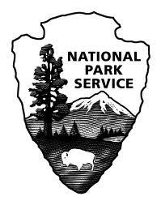

Literature Review Presentation
========================================================
author: Anthony Campbell
date: 2/8/14

Contents
========================================================

1. Literature review subject
2. Search tools
3. Useful databases
4. Managing references

Literature Review
========================================================

- I conducted a literature review for a project for the National Parks Service 
- The subject of hurricane impacts and change analysis studies 
that could be applied to Gateway National Recreation Area, Assateague and Fire 
Island National Seashores. 
- Focused on the methodologies of each study, and did not analyze 
the results

Search Tools
========================================================

* I started with http://uri.libguides.com/life
* This is the life sciences staging page
* List of many useful databases that URI has subscriptions too
* Conspicuous absences are Bioone and Google Scholar

Useful Databases
=======

* All easy to search have an account system to save searches
* Many smaller databases may be useful for particular topics
* Read the abstracts!
* Google Scholar very good at locating specific articles and determing URI's access to that article.

Reference Managers
====
|Features| | | |
|---|---|---|---|
| Collaborative Sharing  |  No |  Yes | Yes  | 
| Desktop Client  | No  | Yes  |  Yes |
|  Subscription |  Yes(URI) | No  |  Yes |
|Storage | No | Yes | Yes |
| Pdf import | No | Yes | No |
| One click import | Yes | Yes | Yes|
| Save Searches | No | No | Yes |
| Word Plugin | Yes | Yes | Yes |
| Web version has full functionality | Yes | No | No |

